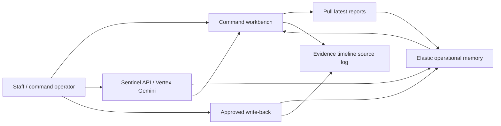

# Stadium Sentinel

Stadium Sentinel helps stadium staff understand and act on live incident updates during an event.

## Problem It Solves

Live event operations receive fragmented updates from guest services, security, facilities, and radio channels. Staff need to know what happened, who is handling it, what changed, and what needs to happen next — without hunting across disconnected tools.

Stadium Sentinel turns live reports and command-center updates into operational incident context: a prioritized dispatch queue, enriched evidence, timelines, staff wording, and voice-guided next steps grounded in Elastic-backed operational memory.

It is not a CRM, ticketing system, analytics dashboard, map product, seat-map product, or generic dashboard.

## Demo

**Live:** https://stadium-sentinel-726236175501.us-central1.run.app

| Resource | Path |
|----------|------|
| Landing | [`artifacts/screenshot-landing.png`](artifacts/screenshot-landing.png) |
| Command center | [`artifacts/screenshot-command.png`](artifacts/screenshot-command.png) |
| Venue Context schematic | [`artifacts/venue-schematic-1440.png`](artifacts/venue-schematic-1440.png) |
| Workbench layout | [`artifacts/workbench-1440-final.png`](artifacts/workbench-1440-final.png) |

**Demo video:** _Add link when recorded._

**Quick start:** Open the live URL → **Open operations intake** → **Connect operations data** → **Open command center** → **Pull latest reports**.

## Features

- **Elastic-backed incident pull** — connect operations data, bootstrap seed health, and pull current incident packages from operational memory
- **Enriched operational context** — dispatch timeline, staff roster, evidence, and incident details assembled for each incident
- **Dispatch queue** — priority-sorted incident cards (Immediate, High, Moderate, Monitor)
- **Queue completion behavior** — completed incidents move below unresolved work and stay reviewable
- **Venue Context schematic** — compact venue reference with incident markers mapped to real queue incidents
- **Response checklist** — hold contact, confirm outcome, and dispatch actions per incident
- **Utility drawer** — Evidence, Staff Update, Incident log, Report, and Source log panels
- **Sentinel voice agent** — Ask Sentinel for natural incident Q&A from live context
- **Guarded draft / review / submit** — staff updates, reports, next actions, and dispatch require explicit voice approval
- **Approved write-back** — timeline and operational memory updates after operator approval
- **Production Cloud Run deployment** — prebuilt image via Cloud Build with required `NEXT_PUBLIC_*` build args

## Tech Stack

| Layer | Technology |
|-------|------------|
| Framework | Next.js 16 (App Router), React 19, TypeScript |
| Styling | Tailwind CSS 4 |
| Compute | Google Cloud Run |
| Build / deploy | Cloud Build, Docker (standalone output) |
| Operational memory | Elasticsearch (incidents, evidence, dispatch timeline, incident memory) |
| Sentinel backend | Vertex AI (Gemini) when `AGENT_BACKEND_ENABLED=true` |
| Unit tests | Vitest |
| E2E tests | Playwright |

## Architecture

The app runtime uses **direct Elastic retrieval and write paths**. MCP is not part of the in-app voice or command loop. External MCP proof artifacts may exist separately under `artifacts/batch9-mcp-proof/` for appendix demos only.



## Setup

### Install

```bash
npm ci
cp .env.example .env.local
```

### Environment variables

Copy `.env.example` to `.env.local`. Use placeholder names only — never commit secrets.

**Build-time client flags** (inlined during `npm run build`):

- `NEXT_PUBLIC_REAL_DEMO_FLOW`
- `NEXT_PUBLIC_ENABLE_ELASTIC_PULL`
- `NEXT_PUBLIC_ENABLE_SENTINEL_AGENT`
- `NEXT_PUBLIC_ENABLE_SENTINEL_VOICE`
- `NEXT_PUBLIC_SHOW_VENUE_ORIENTATION`
- `NEXT_PUBLIC_SHOW_RADIO_TRANSCRIPT`

**Runtime server** (Cloud Run or local server only):

- `ELASTICSEARCH_URL`, `ELASTICSEARCH_API_KEY`
- `AGENT_BACKEND_ENABLED`, `GOOGLE_CLOUD_PROJECT`, `GOOGLE_CLOUD_LOCATION`, `VERTEX_MODEL`
- Optional index overrides — see `.env.example`

Local Elastic seeding: `npm run index:elastic` (development setup only).

### Development

```bash
npm run dev
```

Open http://localhost:3000

### Tests and build

```bash
npm test
npm run test:e2e
npm run build
npm run verify:real-demo
```

### Deploy

See [docs/INGESTION_DEPLOY_CHECKLIST.md](docs/INGESTION_DEPLOY_CHECKLIST.md) and [docs/STADIUM_SENTINEL_FINAL_EXECUTION_PLAN.md](docs/STADIUM_SENTINEL_FINAL_EXECUTION_PLAN.md). Use Cloud Build with a prebuilt image tag — do not rely on `gcloud run deploy --source .` alone for production flags.

## How to Use

1. Open the app (landing or `/command`).
2. **Connect operations data** at `/demo/intake` if the command center is disconnected.
3. Open **Command center** (`/command`).
4. Click **Pull latest reports** to load Elastic-backed incidents.
5. Select an incident from the dispatch queue.
6. Review **Venue Context**, response checklist, team assignment, and operations timeline.
7. Open drawer tabs: Evidence, Staff Update, Incident log, Report, Source log.
8. Click **Ask Sentinel** for voice Q&A on the selected incident.
9. Approve a drafted staff update, report, next action, or dispatch when prompted.
10. Confirm timeline and source log updates after approval.

Demo script: [docs/real-demo-script.md](docs/real-demo-script.md)
Legacy fallback recording checklist: [docs/demo-recording-checklist.md](docs/demo-recording-checklist.md)

## Key Technical Decisions

- **Direct Elastic operational memory** — pull, context assembly, and approved write-back use Elasticsearch directly in the app runtime
- **No in-app MCP claim** — MCP bridge and Agent Platform proof are external-only; see `artifacts/batch9-mcp-proof/` and [docs/ELASTIC_BUILDER_MCP_SETUP.md](docs/ELASTIC_BUILDER_MCP_SETUP.md)
- **Voice-first Sentinel with guarded approval** — continuous listen loop; casual affirmations do not submit without a pending approval gate
- **Completed incidents below active work** — resolved items remain selectable for review without blocking dispatch focus
- **Media metadata only** — evidence references media IDs and descriptions; no media file storage or rendering pipeline
- **Categorical priority only** — Immediate, High, Moderate, Monitor; no numeric scoring in product copy

## Limitations

- **Browser voice** depends on Web Speech API and microphone permissions; behavior varies by browser
- **Radio transcript panel** is off in production builds (`NEXT_PUBLIC_SHOW_RADIO_TRANSCRIPT=false`); related e2e tests are an optional path
- **MCP is not an in-app runtime capability** unless explicitly implemented later; external proof is separate from `/command`
- **Demo data** is synthetic operational seed data for hackathon and recording flows
- **Manual mic smoke** is recommended before recording demos on production Cloud Run

## License

MIT License

No separate `LICENSE` file is included in this repository at this time.

## Documentation

| Doc | Purpose |
|-----|---------|
| [docs/STADIUM_SENTINEL_FINAL_EXECUTION_PLAN.md](docs/STADIUM_SENTINEL_FINAL_EXECUTION_PLAN.md) | Source of truth for phases, batches, and guardrails |
| [docs/INGESTION_DEPLOY_CHECKLIST.md](docs/INGESTION_DEPLOY_CHECKLIST.md) | Ingestion and Cloud Run deploy checklist |
| [docs/real-demo-script.md](docs/real-demo-script.md) | Live demo narration |
| [docs/demo-recording-checklist.md](docs/demo-recording-checklist.md) | Legacy local fallback recording checklist |
| [docs/devpost-talking-points.md](docs/devpost-talking-points.md) | Submission talking points |
| [docs/ELASTIC_BUILDER_MCP_SETUP.md](docs/ELASTIC_BUILDER_MCP_SETUP.md) | External MCP setup only |
| [artifacts/batch9-mcp-proof/README.md](artifacts/batch9-mcp-proof/README.md) | External MCP verification artifact |
